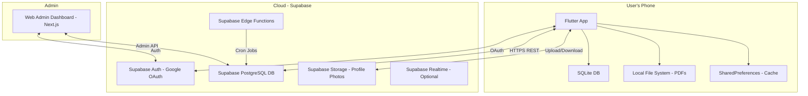
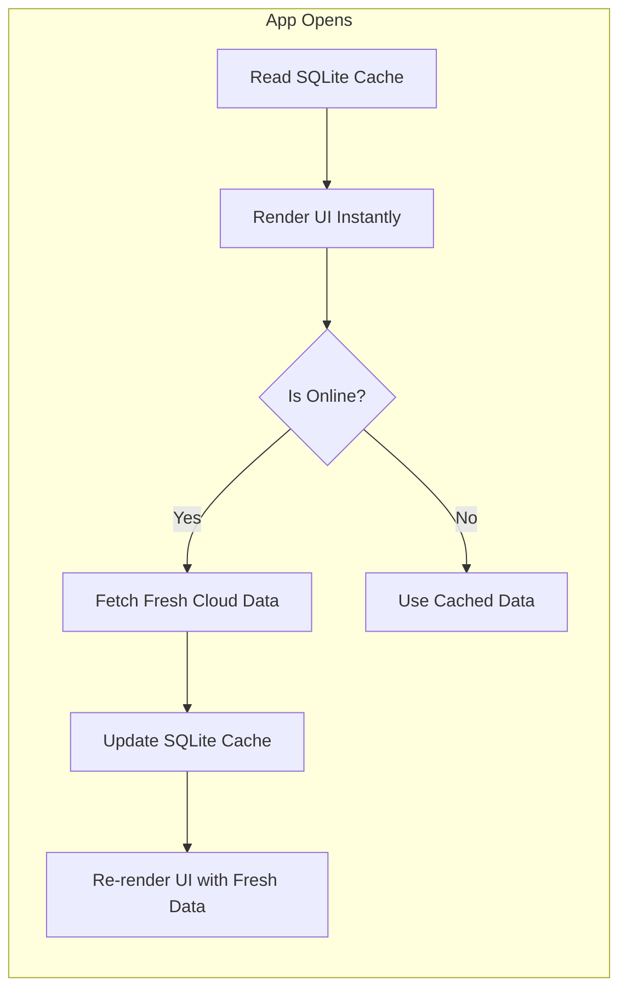
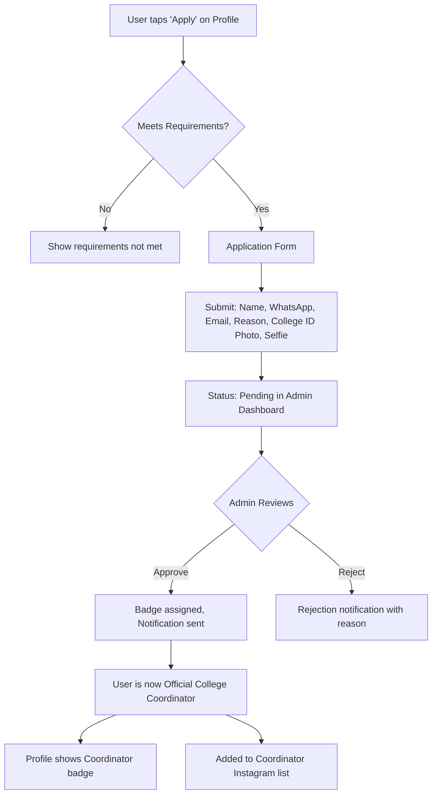

# COLLEZ — COMPLETE MASTER BUILD PLAN

> **The Student Operating System That Turns College Into a Competitive Game**

---

## Table of Contents

1. [Product Vision](#1-product-vision)
2. [Core User Psychology](#2-core-user-psychology)
3. [Full Feature Breakdown](#3-full-feature-breakdown)
4. [Exact User Journeys](#4-exact-user-journeys)
5. [Technical Architecture](#5-technical-architecture)
6. [Database Schema — Supabase (Cloud)](#6-database-schema--supabase-cloud)
7. [SQLite Local Schema](#7-sqlite-local-schema)
8. [API / Sync Strategy](#8-api--sync-strategy)
9. [Security Plan](#9-security-plan)
10. [Admin Dashboard Design](#10-admin-dashboard-design)
11. [XP + Rank Math](#11-xp--rank-math)
12. [Event Engine Design](#12-event-engine-design)
13. [Coordinator Workflow](#13-coordinator-workflow)
14. [UI/UX Screen-by-Screen Plan](#14-uiux-screen-by-screen-plan)
15. [Navigation System](#15-navigation-system)
16. [Build Phases](#16-build-phases-1234)
17. [MVP First Launch Scope](#17-mvp-first-launch-scope)
18. [Viral Growth Strategy for India Colleges](#18-viral-growth-strategy-for-india-colleges)
19. [Instagram Growth System](#19-instagram-growth-system)
20. [Retention Loops](#20-retention-loops)
21. [Risks + Solutions](#21-risks--solutions)
22. [Performance Optimization Strategy](#22-performance-optimization-strategy)
23. [Future Scale Plan to 1M Users](#23-future-scale-plan-to-1m-users)
24. [Exact 90-Day Execution Roadmap](#24-exact-90-day-execution-roadmap)

---

## 1. Product Vision

### One-Liner
**COLLEZ is the competitive operating system for college life — where productivity meets campus pride.**

### The Problem
Indian college students use 6-8 disconnected apps daily: Google Calendar for timetables, Notion/Google Keep for notes, random folders for PDFs, WhatsApp groups for college coordination, and nothing for motivation. There is **zero gamification** in student productivity. No app makes studying feel like *winning*.

### The Solution
A single, lightweight app that replaces fragmented tools with a unified student dashboard — then layers on **competitive psychology** (streaks, XP, ranks, leaderboards, college-vs-college battles) to make daily academic habits addictive.

### Vision Statement
> Within 18 months, COLLEZ will be the default app on every Indian college student's phone — the first thing they open in the morning and the last thing they check at night. Not because they have to, but because their rank depends on it.

### Core Differentiators

| Competitor | What They Do | What COLLEZ Does Differently |
|---|---|---|
| Notion / Google Keep | Generic note-taking | Student-specific, offline-first, zero bloat |
| Habitica | Gamified habits | College identity + campus competition |
| Duolingo | Streak-based learning | Same psychology, applied to *all* of college life |
| College-specific apps | Info portals | Competitive ecosystem + cross-college rivalry |

### Business Model Summary
- **Phase 1-2**: Completely free. Zero monetization. Pure growth.
- **Phase 3+**: Premium themes, coordinator cosmetics, vault sync, campus sponsorships.
- **Target**: <₹2,000/month infrastructure cost for first 50K users.

---

## 2. Core User Psychology

### Why Students Will Use COLLEZ

COLLEZ exploits five proven psychological triggers:

#### 2.1 Loss Aversion (Streaks)
> "I can't break my 47-day streak."

Streak systems work because **losing progress feels worse than gaining it**. Once a student hits 7+ days, they'll open the app daily just to maintain. Duolingo proved this at scale.

#### 2.2 Social Comparison (Leaderboards)
> "I'm ranked #3 in my college but #147 nationally. I need to grind."

Leaderboards create **relative status anxiety**. Students don't just want to be good — they want to be *better than their classmates*. College-level leaderboards make this personal.

#### 2.3 Identity & Belonging (College Badge)
> "I represent VIT Vellore. Our college is #2 in Karnataka."

Tying achievements to college identity creates **tribal loyalty**. Students become ambassadors because their personal rank affects their college's standing.

#### 2.4 Variable Rewards (Events & Treasure Hunts)
> "There's a Diwali treasure hunt live — special XP this week only!"

Unpredictable, time-limited events create **FOMO and dopamine spikes**. Students check the app more when they don't know what's coming.

#### 2.5 Completionism (Badges & Milestones)
> "I only need 200 more XP for Strategist rank."

Progress bars and milestone badges exploit the **endowment effect** — once you've invested effort, you want to reach the next level.

### Retention Psychology Matrix

| Trigger | Feature | Check Frequency |
|---|---|---|
| Loss Aversion | 365-day streak | Daily |
| Social Proof | Leaderboard position change | 2-3x daily |
| Identity | College rank + coordinator badge | Weekly check |
| Variable Reward | Events / treasure hunts | Push + organic |
| Utility | Timetable, tasks, PDFs | Daily need |
| Social | Friend XP comparison | 2-3x weekly |

---

## 3. Full Feature Breakdown

### Module Priority Matrix

| Module | Priority | Storage | Phase |
|---|---|---|---|
| Google Sign-In + Onboarding | P0 | Cloud | 1 |
| Home Dashboard | P0 | Hybrid | 1 |
| Timetable | P0 | Local | 1 |
| To-Do / Notes | P0 | Local | 1 |
| PDF Vault | P0 | Local | 1 |
| Streak System | P0 | Cloud | 1 |
| XP System | P0 | Cloud | 1 |
| Rank System | P0 | Cloud | 1 |
| Leaderboards | P1 | Cloud | 1 |
| Profile System | P0 | Cloud | 1 |
| Daily Quote | P1 | Cloud | 1 |
| Friend System | P1 | Cloud | 2 |
| College Coordinator | P2 | Cloud | 2 |
| Admin Dashboard | P0 | Cloud (Web) | 1 |
| Event System (Trivia) | P2 | Cloud | 2 |
| Treasure Hunts | P2 | Cloud | 3 |
| City/Regional System | P3 | Cloud | 3 |
| Monetization | P3 | Cloud | 4 |

### 3.1 Home Dashboard
**Purpose**: Single-glance daily command center.

| Element | Data Source | Description |
|---|---|---|
| Greeting + Name | Cloud (user profile) | "Hey, Aarav!" with time-aware greeting |
| Streak Badge | Cloud | Fire icon + current day count |
| XP Counter | Cloud | Animated XP total |
| Rank Badge | Cloud | Current rank tier with icon |
| College Name | Cloud | Under profile section |
| Today's Timetable Card | Local (SQLite) | Next 2 classes with time + subject |
| To-Do Card | Local (SQLite) | Active tasks count + progress bar |
| Daily Quote Card | Cloud | Founder's daily quote |
| Active Event Banner | Cloud | If live event exists, show CTA |
| Leaderboard Mini | Cloud | User's rank # in college |
| Quick Action Grid | N/A | Add Task, Quick Note, Upload PDF, Customize |

#### Dashboard Data Loading Strategy
1. **Instant**: Local data (timetable, tasks) rendered from SQLite — 0ms wait
2. **Background**: Cloud data (XP, streak, quote, event) fetched async
3. **Cached**: Last-known cloud values shown until fresh data arrives
4. **Skeleton**: Shimmer placeholders for cloud cards during first load

### 3.2 Timetable System (100% Local)

| Feature | Description |
|---|---|
| Weekly View | Mon-Sat day selector tabs |
| Add Subject | Subject name, start time, end time, color label |
| Edit/Delete | Long-press or swipe actions |
| Drag Reorder | Reorder subjects within a day |
| Duplicate Day | Copy previous day's schedule |
| Semester Reset | Clear all and start fresh |
| Auto-Today | Opens to current day automatically |
| Color System | 6 preset colors (primary, secondary, tertiary, error, custom 1, custom 2) |

> [!NOTE]
> No reminders, no attendance tracking, no XP from timetable. This is a pure utility feature to drive daily opens (which count toward streaks).

### 3.3 To-Do + Notes System (100% Local)

**Tasks:**

| Feature | Description |
|---|---|
| Create Task | Title, optional description, category, due date |
| Categories | Study, Personal, College (color-coded chips) |
| Mark Complete | Checkbox with strikethrough animation |
| Pin Task | Pinned tasks float to top |
| Archive | Move completed tasks to archive |
| Search | Full-text search across title + description |
| Folders | Organize tasks into custom folders |

**Notes:**

| Feature | Description |
|---|---|
| Quick Note | Title + rich text body |
| Subject Tag | Tag notes to subjects |
| Pin | Pinned notes displayed prominently |
| Search | Full-text search |
| Archive | Soft delete to archive |
| Sort | By date, by subject, by pinned |

### 3.4 PDF Vault (100% Local)

| Feature | Description |
|---|---|
| Upload | Pick PDF from phone file system |
| Folder Structure | Semester → Subject → Type (PYQ, Books, Notes, Important) |
| Create Folder | Custom folder creation |
| Rename | Rename files and folders |
| Move | Move files between folders |
| Delete | Delete with confirmation |
| Recent | Last 10 accessed files shown at top |
| Search | Search by filename |
| Storage Display | Show phone storage used by vault |
| Open | Open PDF in system viewer (no in-app viewer to save APK size) |

> [!IMPORTANT]
> PDFs are stored on the phone's local file system, NOT in SQLite. SQLite only stores metadata (filename, path, folder_id, timestamps). This keeps the DB tiny and the app fast.

### 3.5 Streak System

**365-Day Glory Streak**

Any ONE of these actions per day maintains the streak:

| Action | Counts? |
|---|---|
| Open app (foreground for >5 seconds) | ✅ |
| View timetable screen | ✅ |
| Complete a task | ✅ |
| Participate in trivia event | ✅ |
| Visit leaderboard screen | ✅ |
| Read daily quote (scroll into view) | ✅ |

**Milestone Badges:**

| Days | Badge Name | Badge Icon |
|---|---|---|
| 7 | Week Warrior | 🔥 Bronze flame |
| 30 | Monthly Grinder | 🔥 Silver flame |
| 60 | Consistency King | ⚡ Lightning |
| 100 | Century Scholar | 💯 Gold badge |
| 180 | Half-Year Hero | 🏆 Trophy |
| 365 | Glory Legend | 👑 Crown |

**Streak Protection Logic:**
- Streak resets at **midnight IST** if no qualifying action was recorded that calendar day.
- **Grace period**: None initially. Add a 1-day freeze (earned at 30+ days) in Phase 2 as a "streak shield" reward.
- Streak data is synced to Supabase with `last_active_date` and `streak_count`.

### 3.6 Friend System

| Feature | Phase |
|---|---|
| Search users by username | Phase 2 |
| Send friend request | Phase 2 |
| Accept / Reject request | Phase 2 |
| Remove friend | Phase 2 |
| View friend's public profile | Phase 2 |
| Compare streak | Phase 3 |
| Compare XP | Phase 3 |
| Challenge system | Phase 4 |

### 3.7 College Coordinator System

See [Section 13: Coordinator Workflow](#13-coordinator-workflow) for full details.

### 3.8 Profile System

**Public Profile Fields:**

| Field | Source | Editable? |
|---|---|---|
| Profile Photo | Cloud (Supabase Storage) | ✅ |
| Full Name | Cloud | ✅ |
| Username | Cloud | ✅ (once per 30 days) |
| College | Cloud | ✅ (once, admin can reset) |
| Rank Tier | Cloud (computed) | ❌ |
| XP Total | Cloud | ❌ |
| Streak Days | Cloud | ❌ |
| Badges Earned | Cloud | ❌ |
| Coordinator Badge | Cloud | ❌ (admin assigned) |
| Friend Button | N/A | Action button for visitors |

---

## 4. Exact User Journeys

### Journey 1: First-Time User (Day 1)

```
App Install → Splash Screen (2s) → Login Page
    → Tap "Sign in with Google" → Google OAuth flow
    → Onboarding Step 1: Full Name + Username + Optional Photo
    → Onboarding Step 2: College Selection
        → Search college → Found? Select it
        → Not found? → "Request New College" form
            → Submit → "Pending approval" state
    → Home Dashboard (empty state with guided setup prompts)
    → Guided: "Add your first class" → Timetable
    → Guided: "Create a task" → To-Do
    → Streak starts (Day 1 auto-counted from app open)
    → XP +2 (daily login bonus)
```

### Journey 2: Returning User (Day 7+)

```
App Open → Splash (0.5s, cached data) → Home Dashboard
    → See streak count "🔥 7 Days" → Satisfaction dopamine
    → Glance at timetable card → See next class
    → Check daily quote → Minor XP action logged
    → Notice leaderboard rank changed → Tap to see full board
    → See college leaderboard → Notice rival passed them
    → Motivated → Open tasks → Complete 2 tasks
    → Check XP: +2 login, +0 (tasks don't give XP) = 2 XP today
    → Notice event banner: "Diwali Trivia LIVE" → Join for +5-50 XP
    → Day complete. Streak maintained.
```

### Journey 3: Coordinator Applicant

```
User has 30+ day streak, Grinder rank minimum
    → Profile → "Apply to be College Coordinator"
    → Fill form: Name, WhatsApp, Email, Reason, College ID photo, Selfie
    → Submit → Status: "Under Review"
    → Admin reviews in dashboard → Approves
    → User gets notification → Badge appears on profile
    → User now has "Official College Coordinator" tag
    → User can report issues, gets featured on Instagram
```

### Journey 4: Event Participation (Trivia)

```
Home Dashboard → Event Banner: "Republic Day Trivia 🇮🇳"
    → Tap "Join Now"
    → Trivia screen: 10 questions, 15 seconds each
    → Complete → Score: 8/10
    → XP earned: +40 (8 correct × 5 XP each)
    → Leaderboard updates
    → Badge: "Republic Day Scholar" if score ≥ 7/10
    → Return to dashboard → XP counter animates up
```

### Journey 5: Treasure Hunt

```
Event Banner: "Diwali Treasure Hunt 🪔"
    → Tap "Start Hunt"
    → Clue 1: Solve a Sudoku puzzle → Correct → Unlock Clue 2
    → Clue 2: "Find the hidden icon on the Leaderboard page"
        → Navigate to Leaderboard → Tap hidden Diwali lamp icon
        → Clue 3 unlocked
    → Clue 3: "What is the daily quote from Oct 15?"
        → Check quote archive → Enter answer
        → Clue 4 unlocked
    → Clue 4: Unscramble word puzzle
    → Clue 5: "Visit your profile and tap your rank badge 3 times"
        → Easter egg action → Hunt Complete!
    → Reward: +40 XP, "Treasure Hunter" badge, Instagram spotlight
```

---

## 5. Technical Architecture

### High-Level Architecture Diagram



### Tech Stack Detail

| Layer | Technology | Rationale |
|---|---|---|
| **Frontend** | React Native + Expo (SDK 52+) | Single codebase for Android + iOS. Expo ecosystem (EAS Build, OTA updates) speeds up development. Team already has Expo experience. |
| **Language** | TypeScript | Type safety, better IDE support, fewer runtime bugs |
| **State Management** | Zustand | Lightweight, zero boilerplate, performant. Perfect for medium-scale RN apps. |
| **Navigation** | Expo Router (file-based) | Next.js-style file routing for React Native. Built on React Navigation. |
| **Local Database** | expo-sqlite | Zero-latency reads, offline-first, solid Expo integration |
| **Cloud Backend** | Supabase (Free tier → Pro) | PostgreSQL, Auth, Storage, Edge Functions. Free tier: 500MB DB, 1GB storage, 50K MAU |
| **Authentication** | Supabase Auth + Google Sign-In | `@react-native-google-signin/google-signin` → Supabase `signInWithIdToken` |
| **Cloud Storage** | Supabase Storage | Profile photos only. ~50KB per user avg. 50K users = ~2.5GB |
| **Admin Dashboard** | Next.js (deployed on Vercel free tier) | Fast to build, free hosting, SSR for admin security |
| **Analytics** | Firebase Analytics (free) | Via `@react-native-firebase/analytics` |
| **Crash Reporting** | Firebase Crashlytics (free) | Via `@react-native-firebase/crashlytics` |
| **Push Notifications** | Expo Push Notifications (free) | `expo-notifications` + Expo Push API → no FCM complexity in Phase 2 |
| **OTA Updates** | EAS Update | Push JS-only updates instantly without Play Store review |

### Cost Projection

| Component | Free Tier Limit | Cost at 50K Users | Cost at 200K Users |
|---|---|---|---|
| Supabase | 500MB DB, 1GB storage, 50K MAU | $0 (within free tier) | $25/mo (Pro plan) |
| Vercel (Admin) | 100GB bandwidth | $0 | $0 |
| Firebase Analytics | Unlimited | $0 | $0 |
| Firebase FCM | Unlimited | $0 | $0 |
| Domain | N/A initially | $12/year | $12/year |
| **Total** | — | **~$1/mo** | **~$26/mo** |

> [!TIP]
> At 50K users, the entire infrastructure costs essentially $0-1/month. Even at 200K users with Supabase Pro, you're at ~$26/month. This is extremely startup-friendly.

### React Native + Expo Project Structure

```
collez-app/
├── app/                              # Expo Router (file-based routing)
│   ├── _layout.tsx                   # Root layout: fonts, session, SQLite init
│   ├── index.tsx                     # Splash + auth redirect
│   ├── (auth)/
│   │   ├── login.tsx                 # Login screen
│   │   └── onboarding/
│   │       ├── step1.tsx             # Profile setup
│   │       ├── step2.tsx             # College selection
│   │       └── step3.tsx             # Completion
│   ├── (tabs)/
│   │   ├── _layout.tsx               # Bottom tab navigator
│   │   ├── home.tsx                  # Home dashboard
│   │   ├── rankings.tsx              # Leaderboard
│   │   ├── friends.tsx               # Friends
│   │   ├── vault/
│   │   │   ├── _layout.tsx           # Top tab navigator (Vault hub)
│   │   │   ├── timetable.tsx
│   │   │   ├── tasks.tsx
│   │   │   └── pdfs.tsx
│   │   └── profile.tsx
│   ├── profile/
│   │   └── [id].tsx                  # Other user profile
│   ├── events/
│   │   ├── index.tsx                 # Event list
│   │   ├── trivia/[id].tsx
│   │   └── hunt/[id].tsx
│   └── settings.tsx
├── src/
│   ├── config/
│   │   ├── theme.ts                  # Design tokens (colors, fonts, spacing)
│   │   ├── constants.ts              # XP values, rank thresholds, etc.
│   │   └── supabase.ts               # Supabase client init
│   ├── store/                        # Zustand stores
│   │   ├── authStore.ts
│   │   ├── userStore.ts
│   │   ├── streakStore.ts
│   │   ├── xpStore.ts
│   │   ├── timetableStore.ts
│   │   ├── taskStore.ts
│   │   ├── noteStore.ts
│   │   ├── vaultStore.ts
│   │   ├── leaderboardStore.ts
│   │   └── eventStore.ts
│   ├── services/
│   │   ├── authService.ts
│   │   ├── streakService.ts
│   │   ├── xpService.ts
│   │   └── sqliteService.ts
│   ├── models/
│   │   ├── user.ts
│   │   ├── college.ts
│   │   ├── streak.ts
│   │   ├── xp.ts
│   │   ├── event.ts
│   │   ├── timetable.ts
│   │   ├── task.ts
│   │   ├── note.ts
│   │   ├── pdf.ts
│   │   └── friend.ts
│   ├── utils/
│   │   ├── dateUtils.ts
│   │   ├── rankCalculator.ts
│   │   └── xpCalculator.ts
│   ├── components/
│   │   ├── shared/
│   │   │   ├── GlassCard.tsx
│   │   │   ├── GradientButton.tsx
│   │   │   ├── ShimmerLoader.tsx
│   │   │   ├── BadgeIcon.tsx
│   │   │   └── BottomNavBar.tsx
│   │   ├── home/
│   │   │   ├── GreetingHeader.tsx
│   │   │   ├── StatPills.tsx
│   │   │   ├── EventBanner.tsx
│   │   │   ├── TimetableCard.tsx
│   │   │   ├── TasksCard.tsx
│   │   │   ├── QuoteCard.tsx
│   │   │   ├── LeaderboardMini.tsx
│   │   │   └── QuickActions.tsx
│   │   ├── timetable/
│   │   │   ├── DayTabs.tsx
│   │   │   ├── SubjectCard.tsx
│   │   │   └── AddSubjectSheet.tsx
│   │   ├── tasks/
│   │   │   └── AddTaskSheet.tsx
│   │   ├── notes/
│   │   │   └── NoteEditor.tsx
│   │   ├── vault/
│   │   ├── leaderboard/
│   │   │   ├── RankRow.tsx
│   │   │   └── UserRankCard.tsx
│   │   └── profile/
│   └── hooks/
│       ├── useAuth.ts
│       ├── useStreak.ts
│       ├── useOffline.ts
│       └── useToast.ts
└── assets/
    ├── fonts/                        # Space Grotesk + Manrope
    └── images/
```

---

## 6. Database Schema — Supabase (Cloud)

### 6.1 `users` Table

```sql
CREATE TABLE users (
    id UUID PRIMARY KEY DEFAULT gen_random_uuid(),
    google_id TEXT UNIQUE NOT NULL,
    email TEXT UNIQUE NOT NULL,
    full_name TEXT NOT NULL,
    username TEXT UNIQUE NOT NULL,
    avatar_url TEXT,
    college_id UUID REFERENCES colleges(id),
    xp INTEGER DEFAULT 0 NOT NULL,
    streak_count INTEGER DEFAULT 0 NOT NULL,
    last_active_date DATE,
    longest_streak INTEGER DEFAULT 0 NOT NULL,
    rank_tier TEXT DEFAULT 'fresher' NOT NULL,
    is_coordinator BOOLEAN DEFAULT FALSE,
    coordinator_type TEXT, -- 'college', 'city', 'state'
    coordinator_region TEXT, -- city/state name if applicable
    is_banned BOOLEAN DEFAULT FALSE,
    is_graduated BOOLEAN DEFAULT FALSE,
    featured BOOLEAN DEFAULT FALSE,
    daily_xp_earned INTEGER DEFAULT 0 NOT NULL, -- resets daily, anti-cheat cap
    last_xp_reset_date DATE,
    created_at TIMESTAMPTZ DEFAULT NOW(),
    updated_at TIMESTAMPTZ DEFAULT NOW()
);

CREATE INDEX idx_users_college ON users(college_id);
CREATE INDEX idx_users_xp ON users(xp DESC);
CREATE INDEX idx_users_streak ON users(streak_count DESC);
CREATE INDEX idx_users_username ON users(username);
```

### 6.2 `colleges` Table

```sql
CREATE TABLE colleges (
    id UUID PRIMARY KEY DEFAULT gen_random_uuid(),
    name TEXT NOT NULL,
    city TEXT NOT NULL,
    state TEXT NOT NULL,
    is_approved BOOLEAN DEFAULT FALSE,
    is_disabled BOOLEAN DEFAULT FALSE,
    total_xp BIGINT DEFAULT 0, -- sum of all student XP
    student_count INTEGER DEFAULT 0,
    requested_by UUID REFERENCES users(id),
    created_at TIMESTAMPTZ DEFAULT NOW(),
    updated_at TIMESTAMPTZ DEFAULT NOW()
);

CREATE INDEX idx_colleges_state ON colleges(state);
CREATE INDEX idx_colleges_city ON colleges(city);
CREATE INDEX idx_colleges_approved ON colleges(is_approved);
CREATE INDEX idx_colleges_total_xp ON colleges(total_xp DESC);
```

### 6.3 `xp_transactions` Table

```sql
CREATE TABLE xp_transactions (
    id UUID PRIMARY KEY DEFAULT gen_random_uuid(),
    user_id UUID REFERENCES users(id) NOT NULL,
    amount INTEGER NOT NULL,
    source TEXT NOT NULL, -- 'daily_login', 'trivia', 'treasure_hunt', 'event', 'bonus', 'weekly_streak'
    source_id UUID, -- references event/trivia ID if applicable
    description TEXT,
    created_at TIMESTAMPTZ DEFAULT NOW()
);

CREATE INDEX idx_xp_trans_user ON xp_transactions(user_id);
CREATE INDEX idx_xp_trans_date ON xp_transactions(created_at);
CREATE INDEX idx_xp_trans_source ON xp_transactions(source);
```

### 6.4 `streak_logs` Table

```sql
CREATE TABLE streak_logs (
    id UUID PRIMARY KEY DEFAULT gen_random_uuid(),
    user_id UUID REFERENCES users(id) NOT NULL,
    action_type TEXT NOT NULL, -- 'app_open', 'timetable_view', 'task_complete', 'trivia', 'leaderboard_view', 'quote_read'
    logged_date DATE NOT NULL DEFAULT CURRENT_DATE,
    created_at TIMESTAMPTZ DEFAULT NOW(),
    UNIQUE(user_id, logged_date) -- one streak entry per day
);

CREATE INDEX idx_streak_user_date ON streak_logs(user_id, logged_date);
```

### 6.5 `friend_requests` Table

```sql
CREATE TABLE friend_requests (
    id UUID PRIMARY KEY DEFAULT gen_random_uuid(),
    sender_id UUID REFERENCES users(id) NOT NULL,
    receiver_id UUID REFERENCES users(id) NOT NULL,
    status TEXT DEFAULT 'pending' NOT NULL, -- 'pending', 'accepted', 'rejected'
    created_at TIMESTAMPTZ DEFAULT NOW(),
    updated_at TIMESTAMPTZ DEFAULT NOW(),
    UNIQUE(sender_id, receiver_id)
);

CREATE INDEX idx_friends_receiver ON friend_requests(receiver_id, status);
CREATE INDEX idx_friends_sender ON friend_requests(sender_id, status);
```

### 6.6 `friendships` Table (Denormalized for fast queries)

```sql
CREATE TABLE friendships (
    id UUID PRIMARY KEY DEFAULT gen_random_uuid(),
    user_id UUID REFERENCES users(id) NOT NULL,
    friend_id UUID REFERENCES users(id) NOT NULL,
    created_at TIMESTAMPTZ DEFAULT NOW(),
    UNIQUE(user_id, friend_id)
);

CREATE INDEX idx_friendships_user ON friendships(user_id);
```

### 6.7 `coordinator_applications` Table

```sql
CREATE TABLE coordinator_applications (
    id UUID PRIMARY KEY DEFAULT gen_random_uuid(),
    user_id UUID REFERENCES users(id) NOT NULL,
    college_id UUID REFERENCES colleges(id) NOT NULL,
    full_name TEXT NOT NULL,
    whatsapp_number TEXT NOT NULL,
    email TEXT NOT NULL,
    reason TEXT NOT NULL,
    college_id_photo_url TEXT NOT NULL,
    selfie_url TEXT NOT NULL,
    status TEXT DEFAULT 'pending' NOT NULL, -- 'pending', 'approved', 'rejected'
    admin_notes TEXT,
    reviewed_at TIMESTAMPTZ,
    created_at TIMESTAMPTZ DEFAULT NOW()
);

CREATE INDEX idx_coord_apps_status ON coordinator_applications(status);
CREATE INDEX idx_coord_apps_college ON coordinator_applications(college_id);
```

### 6.8 `quotes` Table

```sql
CREATE TABLE quotes (
    id UUID PRIMARY KEY DEFAULT gen_random_uuid(),
    text TEXT NOT NULL,
    author TEXT,
    scheduled_date DATE UNIQUE, -- one quote per day
    is_active BOOLEAN DEFAULT TRUE,
    created_at TIMESTAMPTZ DEFAULT NOW()
);

CREATE INDEX idx_quotes_date ON quotes(scheduled_date);
```

### 6.9 `events` Table

```sql
CREATE TABLE events (
    id UUID PRIMARY KEY DEFAULT gen_random_uuid(),
    title TEXT NOT NULL,
    description TEXT,
    event_type TEXT NOT NULL, -- 'trivia', 'treasure_hunt', 'puzzle_rush', 'college_battle', 'streak_marathon'
    status TEXT DEFAULT 'upcoming' NOT NULL, -- 'upcoming', 'live', 'ended'
    start_time TIMESTAMPTZ NOT NULL,
    end_time TIMESTAMPTZ NOT NULL,
    xp_reward INTEGER DEFAULT 0,
    badge_name TEXT,
    banner_image_url TEXT,
    config JSONB, -- stores trivia questions, hunt clues, etc.
    created_at TIMESTAMPTZ DEFAULT NOW()
);

CREATE INDEX idx_events_status ON events(status);
CREATE INDEX idx_events_type ON events(event_type);
CREATE INDEX idx_events_time ON events(start_time);
```

### 6.10 `event_participations` Table

```sql
CREATE TABLE event_participations (
    id UUID PRIMARY KEY DEFAULT gen_random_uuid(),
    event_id UUID REFERENCES events(id) NOT NULL,
    user_id UUID REFERENCES users(id) NOT NULL,
    score INTEGER DEFAULT 0,
    xp_earned INTEGER DEFAULT 0,
    completed BOOLEAN DEFAULT FALSE,
    progress JSONB, -- for treasure hunts: tracks which clues solved
    started_at TIMESTAMPTZ DEFAULT NOW(),
    completed_at TIMESTAMPTZ,
    UNIQUE(event_id, user_id)
);

CREATE INDEX idx_event_part_user ON event_participations(user_id);
CREATE INDEX idx_event_part_event ON event_participations(event_id);
```

### 6.11 `badges` Table

```sql
CREATE TABLE badges (
    id UUID PRIMARY KEY DEFAULT gen_random_uuid(),
    user_id UUID REFERENCES users(id) NOT NULL,
    badge_type TEXT NOT NULL, -- 'streak_7', 'streak_30', ..., 'coordinator', 'event_diwali', etc.
    badge_name TEXT NOT NULL,
    earned_at TIMESTAMPTZ DEFAULT NOW()
);

CREATE INDEX idx_badges_user ON badges(user_id);
```

### 6.12 `user_reports` Table

```sql
CREATE TABLE user_reports (
    id UUID PRIMARY KEY DEFAULT gen_random_uuid(),
    reporter_id UUID REFERENCES users(id) NOT NULL,
    reported_user_id UUID REFERENCES users(id) NOT NULL,
    reason TEXT NOT NULL,
    status TEXT DEFAULT 'pending', -- 'pending', 'reviewed', 'actioned'
    admin_notes TEXT,
    created_at TIMESTAMPTZ DEFAULT NOW()
);
```

### 6.13 Leaderboard Views (Materialized)

```sql
-- College leaderboard (refreshed every 15 minutes via cron)
CREATE MATERIALIZED VIEW mv_college_leaderboard AS
SELECT 
    u.id,
    u.full_name,
    u.username,
    u.avatar_url,
    u.xp,
    u.streak_count,
    u.rank_tier,
    u.college_id,
    c.name AS college_name,
    ROW_NUMBER() OVER (PARTITION BY u.college_id ORDER BY u.xp DESC) AS college_rank,
    ROW_NUMBER() OVER (ORDER BY u.xp DESC) AS national_rank
FROM users u
JOIN colleges c ON u.college_id = c.id
WHERE u.is_banned = FALSE AND u.is_graduated = FALSE AND c.is_approved = TRUE;

CREATE UNIQUE INDEX idx_mv_college_lb ON mv_college_leaderboard(id);

-- Weekly leaderboard (refreshed every 15 minutes)
CREATE MATERIALIZED VIEW mv_weekly_leaderboard AS
SELECT 
    u.id,
    u.full_name,
    u.username,
    u.avatar_url,
    u.college_id,
    c.name AS college_name,
    COALESCE(SUM(xt.amount), 0) AS weekly_xp
FROM users u
JOIN colleges c ON u.college_id = c.id
LEFT JOIN xp_transactions xt ON u.id = xt.user_id 
    AND xt.created_at >= date_trunc('week', NOW())
WHERE u.is_banned = FALSE
GROUP BY u.id, u.full_name, u.username, u.avatar_url, u.college_id, c.name
ORDER BY weekly_xp DESC;

CREATE UNIQUE INDEX idx_mv_weekly_lb ON mv_weekly_leaderboard(id);
```

### Row Level Security (RLS) Policies

```sql
-- Users can read any public profile
CREATE POLICY "Public profiles readable" ON users
    FOR SELECT USING (true);

-- Users can only update their own profile
CREATE POLICY "Users update own profile" ON users
    FOR UPDATE USING (auth.uid() = id);

-- XP transactions: users can read their own
CREATE POLICY "Users read own XP" ON xp_transactions
    FOR SELECT USING (auth.uid() = user_id);

-- XP transactions: only service role can insert (prevents client-side cheating)
CREATE POLICY "Service inserts XP" ON xp_transactions
    FOR INSERT WITH CHECK (false); -- Only Edge Functions with service_role can insert

-- Similar policies for all sensitive tables...
```

---

## 7. SQLite Local Schema

### 7.1 `timetable_entries`

```sql
CREATE TABLE timetable_entries (
    id INTEGER PRIMARY KEY AUTOINCREMENT,
    day_of_week INTEGER NOT NULL, -- 0=Mon, 1=Tue, ..., 5=Sat
    subject_name TEXT NOT NULL,
    start_time TEXT NOT NULL, -- "09:00" format
    end_time TEXT NOT NULL,   -- "10:30" format
    color_label TEXT NOT NULL DEFAULT 'primary', -- 'primary','secondary','tertiary','error','custom1','custom2'
    sort_order INTEGER DEFAULT 0,
    semester TEXT, -- optional semester tag
    created_at TEXT DEFAULT (datetime('now')),
    updated_at TEXT DEFAULT (datetime('now'))
);

CREATE INDEX idx_timetable_day ON timetable_entries(day_of_week);
```

### 7.2 `tasks`

```sql
CREATE TABLE tasks (
    id INTEGER PRIMARY KEY AUTOINCREMENT,
    title TEXT NOT NULL,
    description TEXT,
    category TEXT DEFAULT 'personal', -- 'study', 'personal', 'college'
    folder_id INTEGER REFERENCES task_folders(id),
    is_completed INTEGER DEFAULT 0,
    is_pinned INTEGER DEFAULT 0,
    is_archived INTEGER DEFAULT 0,
    due_date TEXT, -- ISO date string
    completed_at TEXT,
    created_at TEXT DEFAULT (datetime('now')),
    updated_at TEXT DEFAULT (datetime('now'))
);

CREATE INDEX idx_tasks_completed ON tasks(is_completed);
CREATE INDEX idx_tasks_folder ON tasks(folder_id);
CREATE INDEX idx_tasks_pinned ON tasks(is_pinned);
```

### 7.3 `task_folders`

```sql
CREATE TABLE task_folders (
    id INTEGER PRIMARY KEY AUTOINCREMENT,
    name TEXT NOT NULL,
    color TEXT DEFAULT 'primary',
    sort_order INTEGER DEFAULT 0,
    created_at TEXT DEFAULT (datetime('now'))
);
```

### 7.4 `notes`

```sql
CREATE TABLE notes (
    id INTEGER PRIMARY KEY AUTOINCREMENT,
    title TEXT NOT NULL,
    body TEXT,
    subject_tag TEXT,
    folder_id INTEGER REFERENCES note_folders(id),
    is_pinned INTEGER DEFAULT 0,
    is_archived INTEGER DEFAULT 0,
    created_at TEXT DEFAULT (datetime('now')),
    updated_at TEXT DEFAULT (datetime('now'))
);

CREATE INDEX idx_notes_pinned ON notes(is_pinned);
CREATE INDEX idx_notes_subject ON notes(subject_tag);
CREATE INDEX idx_notes_folder ON notes(folder_id);
```

### 7.5 `note_folders`

```sql
CREATE TABLE note_folders (
    id INTEGER PRIMARY KEY AUTOINCREMENT,
    name TEXT NOT NULL,
    sort_order INTEGER DEFAULT 0,
    created_at TEXT DEFAULT (datetime('now'))
);
```

### 7.6 `pdf_files`

```sql
CREATE TABLE pdf_files (
    id INTEGER PRIMARY KEY AUTOINCREMENT,
    filename TEXT NOT NULL,
    file_path TEXT NOT NULL, -- absolute path on phone storage
    file_size INTEGER, -- bytes
    folder_id INTEGER REFERENCES pdf_folders(id),
    last_accessed_at TEXT,
    created_at TEXT DEFAULT (datetime('now')),
    updated_at TEXT DEFAULT (datetime('now'))
);

CREATE INDEX idx_pdf_folder ON pdf_files(folder_id);
CREATE INDEX idx_pdf_recent ON pdf_files(last_accessed_at DESC);
```

### 7.7 `pdf_folders`

```sql
CREATE TABLE pdf_folders (
    id INTEGER PRIMARY KEY AUTOINCREMENT,
    name TEXT NOT NULL,
    parent_folder_id INTEGER REFERENCES pdf_folders(id), -- nested folders
    folder_type TEXT, -- 'semester', 'subject', 'pyq', 'books', 'important', 'custom'
    sort_order INTEGER DEFAULT 0,
    created_at TEXT DEFAULT (datetime('now'))
);

CREATE INDEX idx_pdf_folder_parent ON pdf_folders(parent_folder_id);
```

### 7.8 `app_cache`

```sql
CREATE TABLE app_cache (
    key TEXT PRIMARY KEY,
    value TEXT NOT NULL, -- JSON string
    expires_at TEXT, -- ISO datetime, null = never expires
    updated_at TEXT DEFAULT (datetime('now'))
);
```

> [!NOTE]
> The `app_cache` table stores last-known cloud data (XP, streak, quote, user profile) so the app can render instantly even when offline. This is the secret to fast cold starts.

---

## 8. API / Sync Strategy

### Design Principle: **Offline-First, Sync-When-Online**



### API Calls Summary

| Endpoint / Action | Method | When Called | Caching |
|---|---|---|---|
| `GET /users/{id}` | Supabase SELECT | App open, profile visit | Cache 5min |
| `POST /streak_logs` | Supabase INSERT | First qualifying action per day | N/A |
| `GET /quotes?date={today}` | Supabase SELECT | Dashboard load | Cache 24hr |
| `GET /events?status=live` | Supabase SELECT | Dashboard load | Cache 5min |
| `GET /mv_college_leaderboard` | Supabase SELECT | Leaderboard visit | Cache 15min |
| `GET /mv_weekly_leaderboard` | Supabase SELECT | Leaderboard visit | Cache 15min |
| `POST /xp_transactions` | Edge Function | Action completed | N/A |
| `GET /friend_requests` | Supabase SELECT | Friends tab open | Cache 2min |
| `POST /friend_requests` | Supabase INSERT | Send request | N/A |
| `PATCH /friend_requests/{id}` | Supabase UPDATE | Accept/reject | N/A |
| `POST /coordinator_applications` | Supabase INSERT | Apply | N/A |
| `GET /badges?user_id={id}` | Supabase SELECT | Profile load | Cache 10min |

### Sync Strategy for Streak

1. User performs qualifying action (e.g., opens timetable).
2. App checks local flag: `has_streak_logged_today` (SharedPreferences).
3. If FALSE:
   - Log streak action to Supabase `streak_logs` table.
   - Call Edge Function to increment `streak_count` in `users` table.
   - Set local flag to TRUE.
   - Update local cache.
4. If TRUE: Do nothing (already logged today).
5. **Edge Function** handles anti-cheat: refuses if `last_active_date` is not yesterday or today.

### Sync Strategy for XP

1. User earns XP (e.g., completes trivia).
2. App calls **Supabase Edge Function** (NOT direct Supabase insert).
3. Edge Function:
   - Validates action source.
   - Checks daily XP cap.
   - Inserts into `xp_transactions`.
   - Updates `users.xp` and `users.daily_xp_earned`.
   - Updates `colleges.total_xp`.
   - Returns new XP total.
4. App updates local cache and UI.

> [!IMPORTANT]
> XP mutations MUST go through Edge Functions (server-side) to prevent client-side cheating. The client app should NEVER directly insert XP transactions.

### Bandwidth Optimization

| Strategy | Implementation |
|---|---|
| Selective fields | Only fetch needed columns: `.select('id, xp, streak_count')` |
| Pagination | Leaderboard: 20 per page with cursor pagination |
| Conditional fetch | Use `If-None-Match` / ETag headers where possible |
| Batch queries | Dashboard loads: single RPC call returning all dashboard data |
| Image optimization | Profile photos compressed to 200×200px, ~20KB WebP |

---

## 9. Security Plan

### 9.1 Authentication Security

| Threat | Mitigation |
|---|---|
| Fake Google accounts | Google OAuth provides verified email. Require @gmail.com or edu accounts |
| Session hijacking | Supabase JWT with 1-hour expiry, automatic refresh tokens |
| Token theft | Tokens stored in Flutter Secure Storage (encrypted) |
| Multiple accounts | One Google account = one COLLEZ account. Enforce via `google_id` UNIQUE |

### 9.2 XP Anti-Cheat System

| Threat | Mitigation |
|---|---|
| Client-side XP injection | All XP goes through Edge Functions only. Client can't write to xp_transactions directly (RLS blocks it) |
| Rapid action spamming | Debounce: max 1 XP action per source per 5 seconds |
| Daily XP farming | Daily cap of **100 XP/day** (tracked in `users.daily_xp_earned`, reset at midnight IST) |
| Bot accounts | Rate limiting: max 50 API calls/minute per user |
| Trivia answer cheating | Questions randomized order per user. Timer enforced server-side |
| Account sharing XP | Single device fingerprint per session (optional Phase 3) |

### 9.3 Data Security

| Area | Implementation |
|---|---|
| API security | Supabase RLS on all tables. Anon key has read-only access to public data |
| Admin access | Service role key only on admin dashboard (server-side, never exposed to client) |
| File storage | Supabase Storage policies: users can only upload/read their own avatar. Coordinator ID photos visible to admins only |
| Local data | SQLite DB not encrypted (low-sensitivity data: timetable, notes). If needed later: sqlcipher |
| PDF files | Stored in app-specific directory on Android. Not accessible to other apps |

### 9.4 Content Moderation

| Content | Moderation |
|---|---|
| Usernames | Profanity filter on client + server. Regex blocklist |
| Profile photos | Manual review queue in admin dashboard (Phase 2). Initially: trust Google profile photos |
| Coordinator applications | 100% manual review by admin |
| User reports | Admin review queue with action options (warn, ban, delete) |

---

## 10. Admin Dashboard Design

### Tech: Next.js App Router + Supabase Client + Tailwind CSS
### Hosting: Vercel (free tier)
### Access: Protected route — only founder's email can access

### Dashboard Sections

#### 10.1 Overview Page
- Total users count
- New users today / this week
- Active users (DAU / WAU / MAU)
- Total XP distributed
- Active events count
- Pending coordinator applications count
- Pending college approvals count

#### 10.2 Users Management

| Action | Description |
|---|---|
| Search users | By name, username, email, college |
| View profile | Full user details + XP history + streak history |
| Ban user | Soft ban: `is_banned = true`. User sees "Account suspended" |
| Unban user | Reverse ban |
| Soft delete | `is_graduated = true`. Hidden from leaderboards but data preserved |
| Edit profile | Change name, username, college (admin override) |
| Reset XP | Set XP to 0, clear xp_transactions. For cheating cases |
| Feature user | `featured = true`. Used for Instagram spotlights |

#### 10.3 Colleges Management

| Action | Description |
|---|---|
| Approve college | Set `is_approved = true`. Now visible in search |
| Reject college | Delete or set disabled |
| Merge colleges | Move all users from duplicate to primary, delete duplicate |
| Rename college | Update name |
| Disable college | `is_disabled = true`. Fake college handling |
| View college stats | Total students, total XP, top students |

#### 10.4 Content Management

| Action | Description |
|---|---|
| Upload daily quote | Set text, author, scheduled_date |
| Bulk upload quotes | CSV upload for scheduling weeks in advance |
| Create trivia event | Title, questions (JSON), start/end time, XP rewards |
| Create treasure hunt | Title, clues (JSON), puzzles, rewards |
| Assign bonus XP | Select user(s), set amount, set reason |

#### 10.5 Coordinators

| Action | Description |
|---|---|
| View pending applications | List with user details, photos, reason |
| Approve application | User gets coordinator badge |
| Reject application | Send rejection reason |
| Assign city coordinator | Promote from college coordinators |
| Revoke badge | Remove coordinator status |

#### 10.6 Growth Tools

| Action | Description |
|---|---|
| Featured students list | Select students for Instagram spotlight |
| Export user emails | For newsletter (with consent) |
| Analytics dashboard | DAU/WAU/MAU charts, retention funnel |

### Admin Dashboard Wireframe

```
┌────────────────────────────────────────────────────┐
│  COLLEZ ADMIN                         [Logout]     │
├──────────┬─────────────────────────────────────────┤
│          │                                         │
│ Overview │   📊 Dashboard Overview                 │
│ Users    │   ┌───────┐ ┌───────┐ ┌───────┐       │
│ Colleges │   │ 12.4K │ │ 847   │ │ 3     │       │
│ Content  │   │ Users │ │ DAU   │ │ Live  │       │
│ Coords   │   └───────┘ └───────┘ │Events │       │
│ Reports  │                        └───────┘       │
│ Growth   │   ┌─────────────────────────────┐       │
│          │   │ Pending Actions              │       │
│          │   │ • 5 college approvals        │       │
│          │   │ • 3 coordinator apps         │       │
│          │   │ • 2 user reports             │       │
│          │   └─────────────────────────────┘       │
│          │                                         │
└──────────┴─────────────────────────────────────────┘
```

---

## 11. XP + Rank Math

### 11.1 XP Sources & Amounts

| Action | XP Amount | Frequency Cap | Daily Cap Contribution |
|---|---|---|---|
| Daily login (app open) | +2 | 1x per day | 2 |
| Trivia participation | +5 base + 5 per correct answer (max 10 Qs) | Per event | 55 max per trivia |
| Treasure hunt completion | +40 | Per hunt | 40 |
| Puzzle completion | +10 | Per puzzle (max 3/day) | 30 |
| Weekly streak bonus (7+ days) | +25 | 1x per week (Sunday) | 25 |
| Official event participation | +20 | Per event | 20 |
| Admin bonus XP | Variable | Admin discretion | Exempt from cap |

### 11.2 Daily XP Cap

**Hard cap: 100 XP per day** (excluding admin bonus)

Formula:
```
effective_xp = MIN(earned_xp, 100 - daily_xp_earned)
if effective_xp <= 0: reject action
```

**Weekly soft cap: 500 XP per week** (warning trigger for anti-cheat review, not blocking)

### 11.3 Rank Tiers & Thresholds

| Rank Tier | XP Required | Badge Color | Estimated Time to Reach |
|---|---|---|---|
| Fresher | 0 | Gray | Instant |
| Grinder | 100 | Bronze | ~2 weeks |
| Scholar | 500 | Silver | ~2 months |
| Strategist | 1,500 | Gold | ~5 months |
| Elite | 4,000 | Platinum | ~10 months |
| Titan | 10,000 | Diamond | ~2 years |
| Campus Legend | 25,000 | Ruby | ~4 years |
| State Hero | 60,000 | Emerald | ~8 years (or heavy events) |
| National Icon | 150,000 | Obsidian + Glow | Legendary status |

**Rank Calculation (Real-time):**
```typescript
// src/utils/rankCalculator.ts
export type RankTier =
  | 'fresher' | 'grinder' | 'scholar' | 'strategist'
  | 'elite' | 'titan' | 'campus_legend' | 'state_hero' | 'national_icon';

export function getRankTier(xp: number): RankTier {
  if (xp >= 150000) return 'national_icon';
  if (xp >= 60000) return 'state_hero';
  if (xp >= 25000) return 'campus_legend';
  if (xp >= 10000) return 'titan';
  if (xp >= 4000) return 'elite';
  if (xp >= 1500) return 'strategist';
  if (xp >= 500) return 'scholar';
  if (xp >= 100) return 'grinder';
  return 'fresher';
}

export function xpToNextRank(xp: number): number {
  const thresholds = [100, 500, 1500, 4000, 10000, 25000, 60000, 150000];
  return (thresholds.find(t => t > xp) ?? Infinity) - xp;
}
```

### 11.4 College Rank Score

```
college_score = SUM(all_student_xp) / SQRT(student_count)
```

This formula rewards colleges with high engagement *per student*, not just raw numbers. A college with 50 active students averaging 500 XP each will outrank a college with 500 students averaging 20 XP each.

### 11.5 Anti-Cheat Formulas

**Velocity check:**
```
if (xp_earned_last_hour > 80): flag_for_review
if (xp_earned_last_5_min > 50): block_temporarily
```

**Pattern detection (Edge Function, weekly cron):**
```sql
-- Find users who earn exactly max XP every single day (bot pattern)
SELECT user_id, COUNT(*) as perfect_days
FROM (
    SELECT user_id, DATE(created_at) as day, SUM(amount) as daily_total
    FROM xp_transactions
    WHERE created_at > NOW() - INTERVAL '30 days'
    GROUP BY user_id, day
    HAVING SUM(amount) >= 95
) sub
GROUP BY user_id
HAVING COUNT(*) >= 25; -- flagged if 25+ days at cap in a month
```

---

## 12. Event Engine Design

### 12.1 Event Types

| Type | Description | Duration | Frequency |
|---|---|---|---|
| **Trivia** | 10 MCQ questions, timed | 15-30 min | Festival + monthly |
| **Treasure Hunt** | 5-clue scavenger hunt within app | 2-7 days | Quarterly |
| **Puzzle Rush** | Solve puzzles (Sudoku, word, math) | 1 day | Monthly |
| **College Battle** | College vs college XP race | 1 week | Bi-monthly |
| **Streak Marathon** | Maintain streak for bonus XP | 30 days | Seasonal |

### 12.2 Trivia Engine

**Data Structure (stored in `events.config` JSONB):**
```json
{
  "questions": [
    {
      "id": "q1",
      "text": "Who wrote India's national anthem?",
      "options": ["Rabindranath Tagore", "Bankim Chandra", "Sarojini Naidu", "Iqbal"],
      "correct_index": 0,
      "time_limit_seconds": 15
    },
    ...
  ],
  "total_questions": 10,
  "xp_per_correct": 5,
  "participation_xp": 5,
  "passing_score": 7,
  "badge_name": "Republic Day Scholar"
}
```

**Flow:**
1. User taps "Join" → Creates `event_participation` entry.
2. App fetches questions from `events.config`.
3. Questions shown one at a time with countdown timer.
4. Answers submitted incrementally (prevents cheating by closing app).
5. After last question: score calculated, XP awarded via Edge Function.
6. If score ≥ passing_score: badge awarded.

### 12.3 Treasure Hunt Engine

**Data Structure (stored in `events.config` JSONB):**
```json
{
  "clues": [
    {
      "id": "clue1",
      "type": "puzzle",
      "puzzle_type": "sudoku",
      "puzzle_data": { ... },
      "hint": "Solve this to unlock the next clue"
    },
    {
      "id": "clue2",
      "type": "navigate",
      "target_screen": "leaderboard",
      "hidden_element_id": "diwali_lamp",
      "hint": "Find the hidden lamp on the Rankings page"
    },
    {
      "id": "clue3",
      "type": "question",
      "question": "What was the daily quote on October 15th?",
      "answer": "progress over perfection",
      "case_sensitive": false
    },
    {
      "id": "clue4",
      "type": "puzzle",
      "puzzle_type": "word_scramble",
      "puzzle_data": { "word": "COLLEZ", "scrambled": "ZLOLEC" }
    },
    {
      "id": "clue5",
      "type": "action",
      "action": "tap_rank_badge_3x",
      "hint": "Visit your profile and tap your rank badge three times"
    }
  ],
  "total_clues": 5,
  "completion_xp": 40,
  "badge_name": "Treasure Hunter"
}
```

**Practical Treasure Hunt Templates:**

| Hunt Theme | Clue 1 | Clue 2 | Clue 3 | Clue 4 | Clue 5 |
|---|---|---|---|---|---|
| Diwali | Sudoku puzzle | Find hidden diya on Leaderboard | Quote from Oct 15 | Word scramble | Tap streak badge 5x |
| New Year | Math equation | Navigate to PDF Vault, find hidden star | "How many days in your streak?" | Crossword | Share a note (create + archive) |
| Independence Day | Flag trivia question | Find hidden flag on Profile | "Name 3 rank tiers" | Decode cipher message | Complete 3 tasks |
| Exam Season | Formula puzzle | Navigate to Timetable, find icon | "What's your current rank?" | Anagram solver | Upload a PDF |

### 12.4 College Battle

```json
{
  "battle_type": "xp_race",
  "duration_days": 7,
  "scoring": "total_xp_earned_during_battle / student_count",
  "min_participants_per_college": 10,
  "prizes": {
    "1st": { "xp_bonus": 100, "badge": "Battle Champion" },
    "2nd": { "xp_bonus": 50, "badge": "Battle Runner-Up" },
    "3rd": { "xp_bonus": 25, "badge": "Battle Contender" }
  }
}
```

### 12.5 Event Calendar (Annual Plan)

| Month | Event | Type |
|---|---|---|
| January | New Year Trivia | Trivia |
| January | Republic Day Hunt | Treasure Hunt |
| February | Valentine's Quiz | Trivia |
| March | Holi Puzzle Rush | Puzzle Rush |
| March | Exam Season Marathon | Streak Marathon |
| April | College Battle #1 | College Battle |
| May | Summer Break Streak Challenge | Streak Marathon |
| August | Independence Day Hunt | Treasure Hunt |
| September | College Battle #2 | College Battle |
| October | Diwali Mega Event | Trivia + Hunt |
| November | Exam Season Marathon #2 | Streak Marathon |
| December | Christmas Puzzle Rush | Puzzle Rush |
| December | Year-End Awards | Special XP Drops |

---

## 13. Coordinator Workflow

### 13.1 Eligibility Requirements

| Requirement | Threshold |
|---|---|
| Minimum streak | 30 days |
| Minimum rank | Grinder (100+ XP) |
| Account age | 30+ days |
| College status | Approved college |
| Existing coordinator | No existing coordinator for that college |

### 13.2 Application Pipeline



### 13.3 Coordinator Privileges

| Privilege | Description |
|---|---|
| Profile badge | "Official College Coordinator" with special icon |
| Instagram feature | Added to weekly spotlight rotation |
| Report issues | Direct report button visible in admin queue |
| Growth ambassador | Represents college in community |
| Sunday session | Access to founder's weekly WhatsApp session link |
| City coordinator path | Top college coordinators → city coordinator promotion |

### 13.4 City / State Coordinator Selection

| Level | Selection Criteria | Title Example |
|---|---|---|
| City Coordinator | Top college coordinator in city by XP + engagement + admin discretion | City Coordinator – Bengaluru |
| State Coordinator | Top city coordinator in state by performance | State Coordinator – Karnataka |

Selection is **100% manual** by admin. No automated promotion. Admin reviews quarterly.

### 13.5 Coordinator Removal

| Trigger | Action |
|---|---|
| Coordinator requests removal | Admin revokes badge |
| Inactivity (30+ days no login) | Admin reviews, may revoke |
| Violation of conduct | Immediate revoke + potential ban |
| Graduation | Mark as graduated, revoke active status |

### 13.6 Sunday Session Workflow

1. Every Sunday, founder hosts a 30-min WhatsApp call.
2. Coordinators get WhatsApp group link upon approval.
3. Founder shares session link in group every Sunday morning.
4. Topics: feedback, growth ideas, feature requests, shoutouts.
5. Attendance tracked informally. Active coordinators get bonus XP (admin-assigned).

---

## 14. UI/UX Screen-by-Screen Plan

### Design System (Extracted from UI Reference)

| Token | Value |
|---|---|
| **Primary Font** | Space Grotesk (headlines, bold elements) |
| **Body Font** | Manrope (body text, labels) |
| **Background** | `#0B1326` (deep navy) |
| **Surface** | `#0B1326` |
| **Surface Container Low** | `#131B2E` |
| **Surface Container** | `#171F33` |
| **Surface Container High** | `#222A3D` |
| **Surface Container Highest** | `#2D3449` |
| **Primary** | `#B4C5FF` (soft blue) |
| **Primary Container** | `#2563EB` |
| **Secondary** | `#D0BCFF` (lavender) |
| **Tertiary** | `#4CD7F6` (cyan) |
| **Error** | `#FFB4AB` (soft red) |
| **On Surface** | `#DAE2FD` |
| **On Surface Variant** | `#C3C6D7` |
| **Outline** | `#8D90A0` |
| **Border Radius** | 16px default, 32px large, 48px XL |
| **Glass Effect** | `backdrop-blur: 24px`, `bg-opacity: 80%` |
| **Shadow Style** | `0 20px 50px rgba(218,226,253,0.06)` |
| **Gradient** | `linear-gradient(135deg, #B4C5FF, #D0BCFF)` |
| **Icon System** | Material Symbols Outlined (variable weight/fill) |

### Screen-by-Screen Plan

#### Screen 1: Splash Screen
- Full-screen deep navy background
- COLLEZ logo centered with glow effect (`blur-[60px]` primary glow behind)
- Gradient text: "COLLEZ"
- Subtitle: "The Kinetic Scholar"
- Loading bar at bottom with gradient fill
- "Initializing Ecosystem..." micro-text
- **Duration**: 1.5s normal, 0.5s if cached data exists

#### Screen 2: Login Screen
- Ambient background blobs (primary + secondary, `blur-[120px]`, `mix-blend-screen`)
- Centered glassmorphic card (`backdrop-blur-[24px]`, semi-transparent surface)
- App logo with hover glow
- "Welcome to COLLEZ" headline (Space Grotesk, bold)
- "Win College Life" subtitle
- Single Google Sign-In button: pill-shaped, surface-colored, Google SVG icon
- Legal footer: Terms + Privacy links

#### Screen 3: Onboarding — Profile Setup (Step 1 of 3)
- Progress bar (1/3 filled, gradient)
- "Step 1 of 3 — Profile Setup" label
- Avatar upload circle: dashed border, camera icon, tap to upload
- Full Name input: icon prefix (person), rounded, surface-low background
- Username input: icon prefix (@), helper text "You can change this later"
- "Continue" button: full-width, gradient, arrow icon

#### Screen 4: Onboarding — College Selection (Step 2 of 3)
- Progress bar (2/3 filled)
- "Find Your Campus" headline
- Search input: large, search icon, placeholder "Search by name, state..."
- Popular Institutions list: college cards with logo, name, city, student count
- Right sidebar: Recent Views (chips), "Can't find yours?" CTA
- "Request New College" button → opens form

#### Screen 5: Onboarding — College Request Form (Step 2b)
- "Request New College" header
- Input: College full name
- Input: City
- Input: State (dropdown of Indian states)
- Submit button
- Info text: "Your request will be reviewed within 48 hours"

#### Screen 6: Onboarding — Complete (Step 3 of 3)
- Progress bar (3/3 filled)
- Welcome animation (confetti or sparkle)
- "You're all set!" headline
- Summary card: Name, Username, College
- "Enter COLLEZ" gradient button

#### Screen 7: Home Dashboard
- **Top App Bar**: Profile avatar (left), "COLLEZ" branding (center), lightning bolt icon (right)
- **Hero Section**: Time-aware greeting, streak/XP/rank stat pills (horizontal scroll on mobile)
- **Event Banner**: Full-width rounded card with background image, "LIVE" badge, CTA button
- **Bento Grid**:
  - Timetable card (8-col span): Next 2 classes
  - Leaderboard mini (4-col span): Rank ring visualization
  - Tasks progress (6-col): Progress bar + task list
  - Daily quote (6-col): Large quote text with decorative icon
- **Quick Actions Grid**: 4 buttons — Add Task, Quick Note, Upload PDF, Customize
- **Bottom Nav Bar**: Home (active), Rankings, Friends, Vault, Profile

#### Screen 8: Timetable Screen
- Day selector: Horizontal scrollable pill buttons (Mon-Sat)
- Active day highlighted with special color + border
- Vertical timeline layout with:
  - Time labels on left
  - Timeline dots with colored borders
  - Schedule cards: subject name, time range, location, tags
  - Break indicators with dashed lines
- FAB: "+" to add new subject

#### Screen 9: Add Subject Modal
- Bottom sheet / modal overlay with dark backdrop blur
- "Add Subject" header with close button
- Subject Name input
- Start Time / End Time pickers (side by side)
- Color Theme selector: 4-6 colored circles with radio selection + check mark
- "Save Subject" gradient button

#### Screen 10: Tasks Screen
- Header: "Your Tasks" + progress circle (65%, animated)
- Category filter pills: All Tasks, Study, Personal, College
- Task cards in bento grid:
  - Urgent: Red left border, warning icon, deadline prominent
  - Standard: Clean card, category chip, subtle hover effects
  - Completed: Faded opacity, strikethrough, checkmark filled
- FAB: "+" to add new task

#### Screen 11: Notes Screen
- Header: "My Notes" + search bar
- Navigation pills: All, Pinned, Subjects
- Pinned Notes section: Cards with subject tag, title, preview, pin icon (filled)
- Recent Notes section: Lighter cards, subject tags, hover effects
- FAB: "+" to create new note

#### Screen 12: Note Editor Screen
- Back button + Save button in header
- Title input (large, bold)
- Subject tag selector
- Rich text body (basic: bold, italic, bullet list)
- Pin toggle in toolbar

#### Screen 13: PDF Vault Screen
- Header: "Vault" (gradient text) + search bar
- Storage indicator: progress bar showing local storage usage
- Upload button: Gradient card with upload icon
- Folders grid: 2x2 on mobile, 4-col on tablet
  - Folder icon (Material), name, file count
  - "New Folder" card with dashed border + add icon
- Recent Documents list: File icon, name, size, date, more menu
- FAB: Upload PDF

#### Screen 14: Leaderboard Screen
- Tab system: College | City | State | National | Weekly | Monthly
- User's own rank card (highlighted, sticky at top)
- Top 3 podium visualization (optional, Phase 2)
- Scrollable rank list:
  - Rank #, avatar, name, college, XP, streak badge
  - Current user highlighted with different background
- Pull to refresh

#### Screen 15: Friends Screen
- Search bar: "Find colleagues, classmates, or alumni..."
- Pending section: Request cards with accept/reject buttons
- Network section: Friend cards with avatar, name, college, streak badge, "Compare Stats" button
- Empty state: Illustration + "Invite Friends" CTA

#### Screen 16: Profile Screen (Own)
- Large avatar with edit overlay
- Name, username, college name
- Stats row: Rank badge, XP count, Streak count
- Badges grid: Earned badges displayed as icons
- Coordinator badge (if applicable): Special highlighted section
- Settings link
- Edit Profile button
- Logout button

#### Screen 17: Profile Screen (Other User)
- Same layout as own profile but:
  - "Add Friend" / "Friends" / "Pending" button instead of Edit
  - No settings/logout
  - "Report User" in overflow menu

#### Screen 18: Event List Screen
- Active Events section: Large cards with banners
- Upcoming Events: Smaller cards with countdown timers
- Past Events: Collapsed section with completion badges

#### Screen 19: Trivia Screen
- Question number indicator (3/10)
- Timer circle countdown (15s)
- Question text (large, prominent)
- 4 answer option cards (tap to select)
- Selected state: Primary color highlight
- Correct/Wrong feedback: Green check / Red X with brief delay
- Final score screen: Score/total, XP earned, badge earned (if applicable)

#### Screen 20: Treasure Hunt Screen
- Hunt progress: 5-dot progress indicator
- Current clue card: Large, prominent, with puzzle/question
- Puzzle area: Embedded Sudoku/word puzzle
- Text answer input (for text-based clues)
- Navigation prompt (for "go to X screen" clues)
- Completion celebration screen

#### Screen 21: Settings Screen
- Edit Name
- Edit Username (with 30-day restriction notice)
- Change College (admin-required)
- Notification preferences (Phase 2)
- About COLLEZ
- Terms of Service
- Privacy Policy
- Delete Account
- App version

#### Screen 22: College Request Pending State
- Illustration of document review
- "Your college request is under review"
- College name, city, state displayed
- "This usually takes 24-48 hours"
- Contact support link

---

## 15. Navigation System

### Bottom Navigation Bar (5 tabs)

| Tab | Icon | Icon (Active) | Label | Screen |
|---|---|---|---|---|
| Home | `home` (outline) | `home` (filled) | Home | Home Dashboard |
| Rankings | `leaderboard` (outline) | `leaderboard` (filled) | Rankings | Leaderboard Screen |
| Friends | `group` (outline) | `group` (filled) | Friends | Friends Screen |
| Vault | `inventory_2` (outline) | `inventory_2` (filled) | Vault | Vault Hub (Tasks/Notes/PDFs) |
| Profile | `person` (outline) | `person` (filled) | Profile | Profile Screen |

### Vault Hub Sub-Navigation

The "Vault" tab opens a hub with 3 sub-sections:

| Sub-Tab | Content |
|---|---|
| Timetable | Timetable Screen |
| Tasks & Notes | Tasks + Notes combined view |
| PDFs | PDF Vault Screen |

Implemented as a top tab bar within the Vault section.

### Navigation Stack

```
Auth Flow:
  Splash → Login → Onboarding (1→2→3) → Home Dashboard

Main App (Bottom Nav):
  Home Dashboard
  ├── Event Banner → Event Detail / Trivia / Hunt
  ├── Timetable Card → Timetable Screen
  ├── Tasks Card → Tasks Screen
  └── Quick Actions → Add Task Modal / Note Editor / PDF Upload

  Rankings (Leaderboard)
  └── User Tap → Other User Profile

  Friends
  ├── Search → User Results → Other User Profile
  └── Friend Card → Other User Profile

  Vault
  ├── Timetable → Add Subject Modal
  ├── Tasks & Notes → Task Detail / Note Editor
  └── PDFs → Folder View → PDF Open (system viewer)

  Profile
  ├── Edit Profile
  ├── Settings
  ├── Badges Tap → Badge Detail
  └── Coordinator Apply → Application Form
```

### Navigation Implementation: Expo Router (File-Based)

Expo Router uses the file system to define routes automatically — no manual route registration needed.

```
app/
  index.tsx          →  /           (splash/redirect)
  (auth)/login.tsx   →  /login
  (auth)/onboarding/step1.tsx  →  /onboarding/step1
  (auth)/onboarding/step2.tsx  →  /onboarding/step2
  (auth)/onboarding/step3.tsx  →  /onboarding/step3
  (tabs)/home.tsx    →  /home       (inside bottom tab shell)
  (tabs)/rankings.tsx →  /rankings
  (tabs)/friends.tsx →  /friends
  (tabs)/vault/timetable.tsx   →  /vault/timetable
  (tabs)/vault/tasks.tsx       →  /vault/tasks
  (tabs)/vault/pdfs.tsx        →  /vault/pdfs
  (tabs)/profile.tsx →  /profile
  profile/[id].tsx   →  /profile/123   (other user)
  events/index.tsx   →  /events
  events/trivia/[id].tsx → /events/trivia/abc
  settings.tsx       →  /settings
```

```typescript
// app/_layout.tsx — Root layout with auth redirect
import { useEffect } from 'react';
import { Slot, useRouter, useSegments } from 'expo-router';
import { useAuthStore } from '@/src/store/authStore';

export default function RootLayout() {
  const { status } = useAuthStore();
  const router = useRouter();
  const segments = useSegments();

  useEffect(() => {
    if (status === 'unauthenticated') router.replace('/(auth)/login');
    else if (status === 'onboarding') router.replace('/(auth)/onboarding/step1');
    else if (status === 'authenticated') router.replace('/(tabs)/home');
  }, [status]);

  return <Slot />;
}
```

---

## 16. Build Phases (1,2,3,4)

### Phase 1: Foundation (Weeks 1-6) — MVP Launch

**Goal**: Ship a working app that students can use daily.
**Stack**: React Native + Expo + TypeScript + Zustand + Expo Router + expo-sqlite + Supabase

| Feature | Description | Effort |
|---|---|---|
| Expo project setup + dependencies | Expo Router, Zustand, expo-sqlite, Supabase | 1 day |
| Design system | theme.ts tokens, shared components (GlassCard, GradientButton, etc.) | 2 days |
| Google Sign-In | Full auth flow with Supabase, expo-secure-store | 2 days |
| Onboarding (3 steps) | Profile + College selection | 3 days |
| SQLite setup | expo-sqlite, all local tables + CRUD | 2 days |
| Navigation shell | Expo Router file-based, bottom tabs, vault top tabs | 1 day |
| Timetable | Full weekly timetable with drag reorder | 3 days |
| Tasks | Create, complete, pin, archive, folders | 3 days |
| Notes | Create, edit, pin, search | 3 days |
| PDF Vault | expo-document-picker, folders, rename, open | 3 days |
| Streak System | Daily tracking + badge milestones | 2 days |
| XP System | Supabase Edge Functions + daily cap | 3 days |
| Rank System | Tier calculation + display | 1 day |
| Home Dashboard | All cards + data loading + offline cache | 4 days |
| Profile Screen | View + edit + avatar upload | 2 days |
| Leaderboard | College + National + Weekly | 3 days |
| Daily Quote | Fetch + display + 24hr cache | 1 day |
| Admin Dashboard (basic) | Next.js + Users, Colleges, Quotes | 4 days |
| **Total** | | **~6 weeks** |

### Phase 2: Social + Events (Weeks 7-12)

| Feature | Description | Effort |
|---|---|---|
| Friend System | Send/accept/reject/remove | 4 days |
| Friend Profiles | View other user profiles | 2 days |
| Trivia Engine | Question system + scoring | 5 days |
| Event System | Event list + detail screens | 3 days |
| Coordinator Applications | Form + admin review | 3 days |
| Expo Push Notifications | Streak reminders, event alerts (expo-notifications + Expo Push API) | 3 days |
| Streak Shield | 1-day freeze at 30+ days | 1 day |
| City/State Leaderboards | Geo-based ranking views | 2 days |
| Admin: Event Creator | Trivia + event management | 3 days |
| Admin: Coordinator Review | Application pipeline | 2 days |
| Performance Optimization | FlashList, Zustand selectors, Reanimated audit | 3 days |
| **Total** | | **~5 weeks** |

### Phase 3: Engagement + Scale (Weeks 13-20)

| Feature | Description | Effort |
|---|---|---|
| Treasure Hunt Engine | Clue system, puzzle integrations | 7 days |
| Puzzle Rush | Sudoku/word puzzle mini-games | 5 days |
| College Battle | Team competition system | 4 days |
| Friend Comparison | Compare streak/XP side-by-side | 3 days |
| Streak Marathon Events | Extended streak challenges | 2 days |
| City/State Coordinators | Promotion system | 2 days |
| Advanced Anti-Cheat | Pattern detection, velocity checks | 3 days |
| Admin: Growth Tools | Featured students, exports | 3 days |
| Monthly Leaderboard | Reset-based monthly rankings | 2 days |
| **Total** | | **~5 weeks** |

### Phase 4: Polish + Monetization Prep (Weeks 21-28)

| Feature | Description | Effort |
|---|---|---|
| Premium Themes | Dark/light variants, custom colors (react-native-iap or expo-in-app-purchases) | 5 days |
| Badge Cosmetics | Lottie animated badges (lottie-react-native), coordinator frames | 3 days |
| Vault Cloud Sync (Premium) | Optional Supabase Storage backup for PDFs | 5 days |
| Referral System | Invite code → bonus XP | 3 days |
| Widget Support | Android home screen widget via react-native-android-widget | 4 days |
| iOS Port | Apple Sign-In + TestFlight + App Store | 5 days |
| Challenge System | Friend vs friend XP challenges | 4 days |
| Analytics Dashboard (Admin) | Recharts charts, funnels, retention graphs | 4 days |
| EAS Update Automation | OTA update pipeline for JS-only releases | 1 day |
| **Total** | | **~5 weeks** |

---

## 17. MVP First Launch Scope

> [!IMPORTANT]
> **MVP = Phase 1 features only.** Launch with the minimum that creates a complete daily loop.

### MVP Feature Checklist

- [x] Google Sign-In
- [x] 3-step Onboarding (name, username, college)
- [x] Home Dashboard (all cards)
- [x] Timetable (full CRUD, Mon-Sat)
- [x] Tasks (create, complete, pin, archive, folders)
- [x] Notes (create, edit, search, pin)
- [x] PDF Vault (upload, folders, rename, delete, open)
- [x] Streak System (daily tracking, 6 milestones)
- [x] XP System (daily login +2, weekly streak +25)
- [x] Rank System (9 tiers)
- [x] Leaderboard (college + national)
- [x] Daily Quote (admin-uploaded)
- [x] Profile (view + edit)
- [x] Bottom Navigation (5 tabs)
- [x] Admin Dashboard (users, colleges, quotes)
- [ ] ~~Friends System~~ (Phase 2)
- [ ] ~~Events/Trivia~~ (Phase 2)
- [ ] ~~Treasure Hunts~~ (Phase 3)
- [ ] ~~Coordinator System~~ (Phase 2)

### MVP Daily Loop

```
Morning: Open app → Streak maintained (+2 XP) → Check timetable → See today's classes
Daytime: Add tasks → Complete tasks → Jot notes → Upload PDF
Evening: Check leaderboard → See college rank → Read daily quote
Weekly: Streak bonus +25 XP → Rank progress visible
```

### MVP Launch Criteria

| Metric | Target |
|---|---|
| APK size | < 15MB |
| Cold start time | < 2 seconds |
| Crash rate | < 1% |
| Offline functionality | 100% for local features |
| Screens | 15+ complete |
| Test coverage | Core flows manual-tested |

---

## 18. Viral Growth Strategy for India Colleges

### 18.1 The Playbook: College-by-College Domination

**Strategy**: Don't try to grow everywhere at once. Dominate one college at a time, then spread to nearby colleges through competition and FOMO.

#### Phase A: Seed College (Weeks 1-4 post-launch)

| Action | Detail |
|---|---|
| Pick 1 college | Your own college or a college where you have a contact |
| Recruit 10 seed users | Personally onboard them, help set up profiles |
| Create the first leaderboard | 10 users competing = instant engagement |
| Seed daily quotes | Motivational + college-specific |
| Document everything | Screenshots for Instagram content |

#### Phase B: College Cluster (Weeks 5-12)

| Action | Detail |
|---|---|
| Expand to 3-5 nearby colleges | Same city/state as seed college |
| Activate FOMO | "VIT is #1. Can your college beat them?" |
| Appoint coordinators | One per college, selected from top users |
| Start Instagram content | Weekly leaderboard screenshots, student spotlights |
| Begin Sunday sessions | Weekly founder call with coordinators |

#### Phase C: City Domination (Months 3-6)

| Action | Detail |
|---|---|
| Target 1 city | Bengaluru, Pune, or Hyderabad (highest college density) |
| 20+ colleges | City leaderboard becomes meaningful |
| City coordinator | Best college coordinator promoted |
| Instagram memes | College rivalry content (VIT vs SRM vs Manipal) |
| Campus posters | Simple A4 printables distributed by coordinators |

#### Phase D: State → National (Months 6-18)

| Action | Detail |
|---|---|
| State leaderboards | Karnataka vs Tamil Nadu vs Maharashtra |
| National rankings | Cross-state competition |
| Festival events | Diwali, Holi → national participation |
| Press/media | Local college newspapers, student blogs |

### 18.2 Growth Hacks

| Hack | Implementation | Cost |
|---|---|---|
| **College WhatsApp groups** | Coordinators share leaderboard screenshots in class WhatsApp groups | Free |
| **"Your college has been challenged"** | Fake urgency: Share that a rival college is ahead in rankings | Free |
| **Instagram stories** | Weekly "Top Students" card designs, shareable by students | Free |
| **Coordinator referral bonus** | Coordinators earn XP for each user who joins from their college | Free |
| **Printable QR posters** | PDF poster with QR code → download link. Coordinators put in canteens, hostels | ₹100-200 printing |
| **College Reddit/Quora** | Answer "best student apps" questions. Link to COLLEZ | Free |
| **Telegram channels** | Student Telegram groups → share leaderboard updates | Free |
| **Campus ambassadors** | Google DSC, IEEE chapters → partnerships | Free |

### 18.3 Network Effect Triggers

| Users in College | Effect |
|---|---|
| 1-5 | No network effect. Rely on utility (timetable, notes, PDFs) |
| 5-15 | Leaderboard becomes interesting. "Who's #1?" |
| 15-50 | Social proof. "Everyone in my class uses it" |
| 50-200 | College identity forms. "Our college vs theirs" |
| 200+ | Self-sustaining. New students join because everyone's on it |

> [!TIP]
> **Critical mass per college is ~15 users.** Once 15 students in one college are active, the leaderboard creates enough social pressure to grow organically. Focus all initial effort on getting 3-5 colleges to 15+ users each.

---

## 19. Instagram Growth System

### 19.1 Content Pillars (Post 4-5x per week)

| Pillar | Frequency | Example |
|---|---|---|
| Weekly Leaderboard | 1x/week (Sunday) | "This week's Top 5 scholars in Bengaluru" |
| Student Spotlight | 2x/week | "Meet @username — 60-day streak, Scholar rank at VIT" |
| Motivational Quote | 2x/week | Same quote as in-app, branded template |
| Event Promo | As needed | "Diwali Trivia drops tomorrow 🔥" |
| Meme/Humor | 1x/week | College life memes with COLLEZ branding |

### 19.2 Instagram Story Templates

| Template | Content |
|---|---|
| "Rank Check" | "What's your COLLEZ rank? Share to stories!" |
| "Streak Flex" | "Day [X] 🔥 — Can you beat this?" |
| "College Pride" | "[College Name] is #[X] in [State]. Push harder!" |
| "This or That" | "Streaks or XP? 🤔" (engagement poll) |

### 19.3 Student Spotlight Process

1. Admin marks user as `featured = true` in dashboard.
2. Admin creates Instagram post using template.
3. Tags student's Instagram (collected during coordinator onboarding or voluntarily shared).
4. Student reshares to their story → organic reach to their friends.
5. Cycle: 2 spotlights per week, rotating colleges.

### 19.4 Content Creation Workflow

| Step | Time | Tool |
|---|---|---|
| Screenshot leaderboard data | 2 min | Admin dashboard |
| Design post in template | 5 min | Canva (free) |
| Write caption with hashtags | 3 min | Manual |
| Schedule post | 1 min | Later.com (free tier) |
| **Total per post** | **~10 min** | |

### 19.5 Hashtag Strategy

```
Primary: #COLLEZ #StudentLife #CollegeApp
College: #VIT #SRM #Manipal #DelhiUniversity #MumbaiUni
Region: #BengaluruStudents #PuneStudents #HyderabadStudents
Motivation: #StudyMotivation #ExamSeason #CollegeLifeIndia
```

---

## 20. Retention Loops

### 20.1 Daily Retention Loop (Core)

```mermaid
graph LR
    A[Morning Push: "Don't break your streak!"] --> B[Open App]
    B --> C[Streak Maintained ✅]
    C --> D[Check Dashboard]
    D --> E[See 'Today's Timetable']
    E --> F[Use Timetable = Utility Value]
    F --> G[Check Leaderboard]
    G --> H[Social Comparison = Motivation]
    H --> I[Complete Task / Join Event]
    I --> J[XP Earned]
    J --> K[Rank Progress Visible]
    K --> L[Tomorrow: "I need to keep going"]
    L --> A
```

### 20.2 Weekly Retention Loop

| Day | Trigger | Action |
|---|---|---|
| Monday | New week, leaderboard resets | Check weekly standings |
| Wednesday | Mid-week streak check | "You're on Day X — keep going!" |
| Friday | Weekend mindset | "Weekend streak challenge" |
| Sunday | Weekly streak bonus (+25 XP) | Claim bonus, check weekly results |

### 20.3 Monthly Retention Loop

| Week | Trigger |
|---|---|
| Week 1 | Monthly leaderboard starts fresh. Equal playing field |
| Week 2 | Rank tier progress check. "200 XP to next rank!" |
| Week 3 | Mid-month event (trivia or puzzle) |
| Week 4 | Month-end push. Final leaderboard positions lock |

### 20.4 Seasonal Retention

| Season | Event | Special Mechanic |
|---|---|---|
| Exam Season | Streak Marathon | 30-day streak challenge with bonus XP |
| Festival Season | Trivia + Hunts | Time-limited XP events |
| New Semester | Fresh Start | Timetable reset prompt, new goals |
| Summer/Winter Break | Break Streak Challenge | "Maintain streak even during break" |

### 20.5 Re-engagement (Churned Users)

| Days Inactive | Action |
|---|---|
| 2 days | Push: "Your [X]-day streak is at risk! Open COLLEZ now 🔥" |
| 7 days | Push: "You've dropped [X] ranks. Come back and climb!" |
| 14 days | Push: "[Friends who passed them] just hit Scholar rank. You're still Grinder." |
| 30 days | Push: "We miss you. New event launching tomorrow — jump back in!" |
| 60+ days | No more pushes (respect uninstalls) |

---

## 21. Risks + Solutions

### Technical Risks

| Risk | Probability | Impact | Mitigation |
|---|---|---|---|
| Supabase free tier limits exceeded | Medium | High | Monitor usage. Upgrade to Pro ($25/mo) at 40K users. Budget planned. |
| SQLite corruption on low-end devices | Low | High | Use write-ahead logging (WAL) mode. Implement DB backup on app update. |
| Google Sign-In package breaks on update | Low | Critical | Pin package version. Test on every Flutter upgrade. |
| APK size bloat over phases | Medium | Medium | Strict dependency audits. Use deferred loading for event screens. |
| Slow performance on 2GB RAM devices | Medium | High | Lazy loading, pagination, image caching, minimize widget rebuilds. |

### Product Risks

| Risk | Probability | Impact | Mitigation |
|---|---|---|---|
| Cold start problem (no users = no leaderboard) | High | Critical | Seed colleges manually. First 50 users onboarded personally. Fake leaderboard data for first week is **NOT** recommended — use real data even if small. |
| Students lose interest after initial novelty | High | High | Events calendar ensures ongoing surprises. Streak psychology locks in habits. |
| Cheating/botting XP | Medium | High | Server-side XP validation, daily caps, velocity checks, pattern detection. |
| Coordinator abandonment | Medium | Medium | Quarterly reviews. Replace inactive coordinators quickly. Make privileges attractive. |
| College data quality (duplicates, fakes) | High | Medium | Manual admin approval. Search-first UX reduces duplicates. Merge tool in admin. |

### Business Risks

| Risk | Probability | Impact | Mitigation |
|---|---|---|---|
| Solo founder burnout | High | Critical | Phase-based approach. Ship MVP in 6 weeks, then iterate. Automate admin tasks. |
| Copycats if successful | Medium | Medium | Network effects = moat. First-mover advantage in college identity layer. |
| Difficulty monetizing students | High | Medium | Monetization is Phase 4. Initial revenue from campus sponsorships, not student payments. |
| Play Store rejection | Low | Medium | Follow all Play Store policies. Privacy policy page. No misleading claims. |

### Mitigation Priority Order
1. **Ship fast** — beat burnout with early wins.
2. **Anti-cheat from Day 1** — protecting leaderboard integrity is everything.
3. **Manual seeding** — personally onboard first 50 users.
4. **Monitor costs** — Supabase dashboard weekly check.

---

## 22. Performance Optimization Strategy

### 22.1 APK Size Budget

| Category | Target | Strategy |
|---|---|---|
| Dart code | < 5MB | Tree-shaking, deferred imports for event screens |
| Assets | < 2MB | SVG icons (not PNG). Minimal bundled images. |
| Fonts | < 1MB | Subset Space Grotesk + Manrope to Latin chars only |
| Dependencies | < 5MB | Audit all packages. Remove unused. |
| **Total APK** | **< 12-15MB** | |

### 22.2 Cold Start Performance

| Stage | Target | Implementation |
|---|---|---|
| Flutter engine init | < 500ms | Use `FlutterEngineGroup` for fast init |
| Splash → Dashboard | < 1.5s | SQLite cache pre-loads local data. Cloud data loads async |
| Dashboard render | < 200ms | Skeleton screens for cloud cards. Local cards instant |
| Screen transitions | 60fps | Use `SlideTransition` / `FadeTransition`, avoid heavy rebuilds |

### 22.3 Memory Management

| Strategy | Implementation |
|---|---|
| Image caching | `cached_network_image` with 100MB disk cache limit |
| List optimization | `ListView.builder` everywhere (never `ListView` with all children) |
| Provider scope | Scoped providers per feature, dispose when not needed |
| SQLite read optimization | Read-only transactions, indexed queries |
| Pagination | Leaderboard: 20 items per page. Notes/Tasks: 50 per page |

### 22.4 Battery Optimization

| Strategy | Implementation |
|---|---|
| No background services | Zero background work unless FCM push received |
| Minimize network calls | Cache everything. Batch API calls on dashboard load |
| No GPS/Location | Not needed for any feature |
| No Bluetooth/NFC | Not needed |
| Dark theme by default | AMOLED-friendly, reduces power on OLED screens |

### 22.5 Network Optimization

| Strategy | Implementation |
|---|---|
| Batch dashboard API | Single RPC call: `get_dashboard_data()` returns user, streak, XP, quote, events in one response |
| Conditional fetching | Store `last_fetched_at` timestamps. Skip if recent |
| Response compression | Supabase supports gzip by default |
| Image CDN | Supabase Storage serves images via CDN |
| Retry logic | Exponential backoff for failed requests (1s, 2s, 4s, max 3 retries) |

### 22.6 Low-End Device Targets

| Device Spec | Target Performance |
|---|---|
| 2GB RAM, Snapdragon 400-series | Smooth scrolling, no jank |
| Android 8.0+ | Full feature support |
| 3G connection | Dashboard loads in < 5s |
| No connection | All local features work perfectly |

---

## 23. Future Scale Plan to 1M Users

### Infrastructure Scaling Path

| Users | Supabase Plan | DB Size | Storage | Monthly Cost |
|---|---|---|---|---|
| 0-50K | Free | < 500MB | < 1GB | $0 |
| 50K-200K | Pro ($25/mo) | ~2GB | ~5GB | $25 |
| 200K-500K | Pro + compute add-on | ~5GB | ~12GB | $50-75 |
| 500K-1M | Team ($599/mo) or migrate | ~15GB | ~25GB | $200-600 |
| 1M+ | Self-hosted Supabase on AWS/GCP | Scale as needed | Scale | $500-1500 |

### Database Scaling Strategy

1. **Materialized views** for leaderboards (already in schema). Refresh every 15 min via Pg cron.
2. **Read replicas** at 500K+ users for separating leaderboard reads from writes.
3. **Partitioned tables** for `xp_transactions` (partition by month) at 1M+ users.
4. **Redis cache** layer for real-time leaderboard and streak data at 500K+ users.

### App Architecture Evolution

| Scale | Change |
|---|---|
| < 100K | Current architecture (Supabase + SQLite) |
| 100K-500K | Add Firebase Analytics, Remote Config for feature flags |
| 500K-1M | Add Redis cache, read replicas, CDN for static assets |
| 1M+ | Evaluate backend migration to custom Go/Node.js API if Supabase becomes bottleneck |

### Feature Roadmap Beyond Phase 4

| Feature | When | Complexity |
|---|---|---|
| Study Groups (5-person teams) | 6 months post-launch | High |
| In-app chat (friends) | 9 months post-launch | High (use Supabase Realtime) |
| Alumni network | 12 months | Medium |
| Campus marketplace | 12-18 months | High |
| International expansion | 18 months | Medium (localization) |
| Desktop/web app | 12 months | Medium (Flutter web) |
| AI study assistant | 18+ months (if APIs justify cost) | High |

---

## 24. Exact 90-Day Execution Roadmap

### Week 1-2: Foundation

| Day | Task | Deliverable |
|---|---|---|
| Day 1 | Expo project setup (`create-expo-app --template blank-typescript`), folder structure, all deps installed | Clean project running |
| Day 2 | Design system: `src/config/theme.ts` with all colors, typography, spacing. Load fonts (Space Grotesk + Manrope) | Complete design token file |
| Day 3 | Supabase project creation, schema setup (all tables, indexes, RLS, materialized views) | Working database |
| Day 4 | expo-sqlite setup: all local tables, migration system, sqliteService.ts | Local DB ready |
| Day 5 | Auth: Google Sign-In → Supabase integration, authStore.ts, authService.ts | Working login flow |
| Day 6 | Splash screen (`app/index.tsx`) + Login screen (`app/(auth)/login.tsx`) | 2 screens complete |
| Day 7 | Onboarding step 1: Profile setup screen | Step 1 complete |
| Day 8 | Onboarding step 2: College selection + search | Step 2 complete |
| Day 9 | Onboarding step 2b: College request form + step 3: Completion screen | Onboarding complete |
| Day 10 | Navigation shell: `app/(tabs)/_layout.tsx` (bottom tabs) + `app/(tabs)/vault/_layout.tsx` (top tabs) | Navigation working |
| Day 11 | Shared components: GlassCard, GradientButton, ShimmerLoader, BadgeIcon, BottomNavBar | Component library |
| Day 12 | Home Dashboard: layout + GreetingHeader + StatPills | Dashboard skeleton |
| Day 13 | Home Dashboard: TimetableCard + TasksCard (local store data) | 2 cards working |
| Day 14 | Home Dashboard: QuoteCard + EventBanner + QuickActions | Dashboard complete |

### Week 3-4: Core Local Features

| Day | Task | Deliverable |
|---|---|---|
| Day 15 | Timetable screen: DayTabs (ScrollView pills) + timeline FlatList layout | Timetable UI |
| Day 16 | Timetable: AddSubjectSheet bottom modal + timetableStore CRUD | Timetable functional |
| Day 17 | Timetable: Drag reorder (react-native-draggable-flatlist), duplicate day, semester reset | Timetable polished |
| Day 18 | Tasks screen: Category filter pills + FlashList task cards | Tasks UI |
| Day 19 | Tasks: taskStore CRUD + complete animation (Reanimated strikethrough) + pin/archive | Tasks functional |
| Day 20 | Tasks: Folder management, search filter, empty states | Tasks polished |
| Day 21 | Notes screen: Tab pills (All/Pinned/Subjects) + note card FlatList | Notes UI |
| Day 22 | Notes: NoteEditor screen, noteStore CRUD, subject tags | Notes functional |
| Day 23 | Notes: Pin, search, archive, folders | Notes polished |
| Day 24 | PDF Vault: Folder grid + upload button + storage progress bar | Vault UI |
| Day 25 | PDF Vault: expo-document-picker, expo-file-system CRUD, nested folders | Vault functional |
| Day 26 | PDF Vault: Rename, move (action sheet), delete, recent tracking, search | Vault polished |
| Day 27 | Integration: Vault hub top-tab layout wiring all 3 screens | Hub navigation working |
| Day 28 | Testing: Manual test all local features on 2 devices | Bug list + fixes |

### Week 5-6: Cloud Features + Admin

| Day | Task | Deliverable |
|---|---|---|
| Day 29 | streakService.ts: daily tracking, AsyncStorage flag, Supabase insert, milestone detection | Streak logic |
| Day 30 | Streak UI: streakStore, StatPills fire badge, milestone celebration modal (Reanimated) | Streak visual |
| Day 31 | Supabase Edge Functions: `award-xp`, `reset-daily-xp` cron, `refresh-leaderboard` cron | Server-side XP |
| Day 32 | XP UI: xpStore, Reanimated count-up counter, rank badge on dashboard | XP visual |
| Day 33 | rankCalculator.ts, rank badge on profile, XP progress bar to next rank | Ranking working |
| Day 34 | Leaderboard screen: college + national tabs, FlashList rank rows | Leaderboard UI |
| Day 35 | leaderboardStore: materialized view queries, pagination, 15min cache | Leaderboard functional |
| Day 36 | Profile screen: own profile layout, userStore, badges grid | Profile UI |
| Day 37 | Profile: edit bottom sheet, expo-image-picker avatar upload to Supabase Storage, settings screen | Profile functional |
| Day 38 | Daily Quote: quoteService fetch, AsyncStorage 24hr cache, QuoteCard streak trigger | Quote system |
| Day 39 | Admin Dashboard: `npx create-next-app collez-admin`, Supabase service-role client, auth gate | Admin scaffold |
| Day 40 | Admin: Users page (search, ban/unban, reset XP, feature) | Admin users |
| Day 41 | Admin: Colleges page (approve, merge, rename, disable) | Admin colleges |
| Day 42 | Admin: Quotes page (add single, bulk CSV, view calendar) | Admin quotes |

### Week 7-8: Polish + Testing

| Day | Task | Deliverable |
|---|---|---|
| Day 43 | SQLite app_cache implementation, AsyncStorage timestamp gates, offline banner | Offline-first complete |
| Day 44 | ShimmerLoader on all cloud cards (dashboard, leaderboard, profile) | Polished loading states |
| Day 45 | Empty states for all screens (guided prompts, illustrations, zero-results) | Empty state complete |
| Day 46 | Global error boundary, network error views with Retry, API try/catch + cache fallback | Error states |
| Day 47 | Performance profiling: Flashlist audit, Reanimated worklet check, JS thread blockers | Performance report |
| Day 48 | Performance fixes: memo, Zustand selectors, image caching via expo-image | 60fps target |
| Day 49 | APK size audit: remove unused packages, font subset, enable Expo asset optimization | < 25MB target |
| Day 50 | Android testing: 3 device tiers (2GB/4GB/8GB RAM), Android 8.0+ | Device compatibility report |
| Day 51 | Edge cases: dayjs IST timezone, streak midnight rollover, AppState foreground/background | Edge case fixes |
| Day 52 | Accessibility: accessibilityLabel on all buttons, allowFontScaling, contrast check | Basic a11y |
| Day 53 | Privacy Policy + Terms of Service screens in Settings + hosted web pages | Legal pages |
| Day 54 | `eas.json` build config, `app.json` icons/splash, Play Store screenshots + description | Store assets |
| Day 55-56 | Final bug bash, full regression, EAS Internal Testing build upload | Release candidate |

### Week 9-10: Launch + Seed

| Day | Task | Deliverable |
|---|---|---|
| Day 57 | EAS Build production APK → Play Store Internal Testing track | APK on Play Store |
| Day 58 | Beta testing with 10 seed users (own college) | Beta feedback |
| Day 59-60 | Fix critical bugs from beta, `eas update` for JS fixes or new EAS Build for native | Stable build |
| Day 61 | Play Store Production release | **🚀 APP LIVE** |
| Day 62-63 | Manual onboarding of 30 users from seed college | 30 users activated |
| Day 64-65 | Fix post-launch issues via `eas update` (OTA) | Hotfixes |
| Day 66-68 | Expand to 2 more colleges (personal contacts) | 3 colleges, 50+ users |
| Day 69-70 | First Instagram content (leaderboard + spotlight) | Social presence |

### Week 11-12: Growth + Phase 2 Start

| Day | Task | Deliverable |
|---|---|---|
| Day 71-73 | Coordinator recruitment: identify top users at each college | 3 coordinator candidates |
| Day 74-75 | First Sunday session with coordinators | Community ritual established |
| Day 76-78 | Begin Friend System development (Phase 2) | Friend request flow |
| Day 79-80 | QR code poster design + distribution to coordinators | Growth materials |
| Day 81-83 | Begin Trivia Engine development | Basic trivia working |
| Day 84-85 | Instagram content cadence established (4-5 posts/week) | Content pipeline |
| Day 86-88 | Friend System completion + testing | Friends feature live |
| Day 89-90 | Deploy Friend System update. Monthly review: metrics, feedback, bugs | **Phase 1 Complete** |

### 90-Day Success Metrics

| Metric | Target |
|---|---|
| Total Users | 100+ |
| Daily Active Users (DAU) | 40+ |
| 7-Day Retention | > 50% |
| Average Streak Length | > 5 days |
| Colleges Active | 5+ |
| Coordinators Appointed | 3+ |
| Play Store Rating | 4.0+ |
| Crash Rate | < 1% |
| APK Size | < 15MB |
| Monthly Infrastructure Cost | < $5 |

---

## Appendix: Key Decisions Summary

| Decision | Choice | Rationale |
|---|---|---|
| Framework | React Native + Expo (SDK 52+) | Team has Expo experience (Udharo app). EAS Build + OTA updates = fast iteration. Cross-platform. |
| Language | TypeScript | Type safety, fewer runtime bugs, better IDE support |
| State Management | Zustand | Minimal boilerplate, fast, perfect for mobile |
| Navigation | Expo Router (file-based) | Next.js-style routing, built on React Navigation |
| Backend | Supabase | Free tier generous, PostgreSQL power, auth + storage included |
| Local DB | expo-sqlite | Zero-latency, offline-first, native Expo integration |
| Auth | Google Sign-In only | Simplicity. 95%+ of Indian students have Gmail |
| XP validation | Server-side Edge Functions (Deno/TS) | Prevents all client-side cheating |
| Leaderboards | Materialized views | Fast reads, 15-min cron refresh is acceptable |
| PDF storage | Phone file system via expo-file-system | Keeps DB tiny, no storage costs |
| Push notifications | Expo Push Notifications | Simpler than raw FCM; works on both Android + iOS |
| OTA updates | EAS Update | Push JS-only fixes without Play Store review delay |
| Admin dashboard | Separate Next.js web app | Faster to build, free hosting on Vercel, SSR security |
| Monetization timing | Phase 4 (6+ months) | Premature monetization kills growth |
| Growth strategy | 1 college at a time | Network effects need density, not breadth |

---

> [!CAUTION]
> **The #1 risk is not building too little — it's building too much before launch.** Ship Phase 1, get 100 real users, then iterate based on actual behavior. Every feature you add pre-launch is a feature nobody asked for.

---

*Plan authored for solo founder execution. Total estimated build time to MVP: 8-9 weeks of focused development. Total estimated cost to first 50K users: near $0.*
